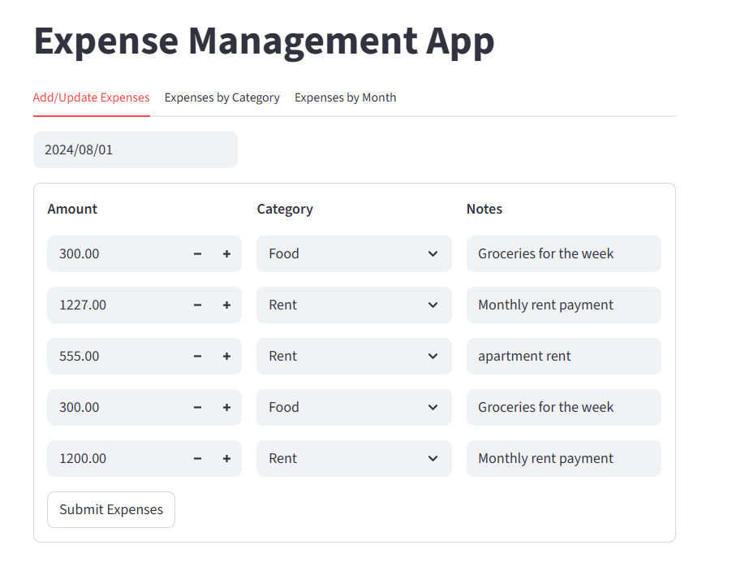
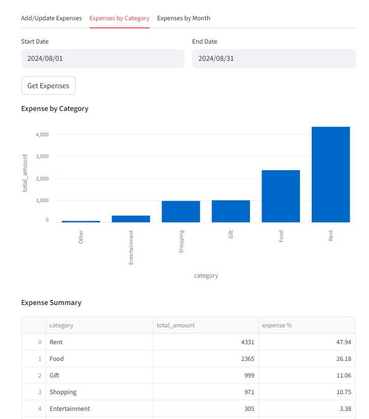
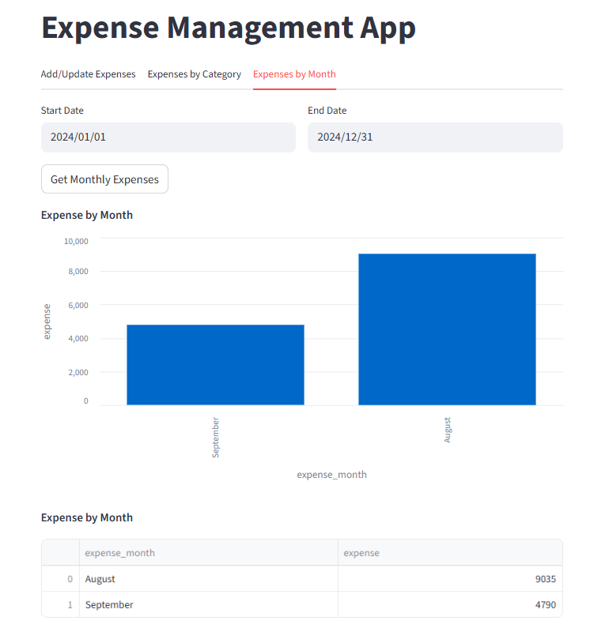

# Expense Management App

The **Expense Management App** is a web-based application designed to help users manage their daily expenses efficiently. It allows users to add, update, and analyze their expenses over a specified time period.


## Features

- **Add/Update Expenses**: Add or update expenses for a specific date.
- **View Analytics**: Visualize expenses by category and analyze spending trends over a selected date range.
- **RESTful API**: Backend powered by FastAPI for managing and retrieving expense data.
- **Interactive Frontend**: Built with Streamlit for a user-friendly interface.


## Tech Stack

### Backend:
- **FastAPI**: For building RESTful APIs.
- **MySQL**: For storing expense data.
- **Pandas**: For data manipulation and analytics.

### Frontend:
- **Streamlit**: For creating an interactive and responsive user interface.


## Installation

### Prerequisites:
- Python 3.8 or higher
- MySQL database

### Steps:
1. Clone the repository:
   ```bash
   git clone https://github.com/tirumalasettiv/ExpenseManagemetApp.git
   cd ExpenseManagemetApp
2. Install dependencies:

    -  Set up the database:

    - Create a MySQL database named  <span style="color:#FFD580;">expense</span>.
    - Update the database connection details in backend/db_connect.py.
3. Run the backend server:
    ```bash 
   cd backend
   uvicorn server:app --reload
4. Run the frontend app:
    ```bash
    cd ../frontend
    streamlit run app.py


## API Endpoints

1. Add/Update Expenses

- Endpoint: <span style="color:#FFD580;">POST /expenses/{expense_date}</span>

POST /expenses/{expense_date}
- Description: Add or update expenses for a specific date.
- Request Body:
```bash 
    [
        {
            "amount": 100.0,
            "category": "Food",
            "notes": "Lunch"
        }
    ]
```

2.  Get Expenses
- Endpoint: <span style="color:#FFD580;">POST /expenses/{expense_date}</span>

- Description: Retrieve expenses for a specific date.
3. Get Expense Summary
- Endpoint: <span style="color:#FFD580;">GET /analytics?start_date={start_date}&end_date={end_date}</span>

- Description: Retrieve expense analytics for a specified date range.


## Project Structure
```bash
    2_ExpenseApp/
    ├── backend/
    │   ├── server.py          # FastAPI server
    │   ├── db_connect.py      # Database connection
    │   └── ...
    ├── frontend/
    │   ├── app.py             # Streamlit frontend
    │   ├── expenses.py        # Expense management logic
    │   ├── analytics.py       # Analytics visualization
    │   └── ...
    ├── [requirements.txt](http://_vscodecontentref_/1)       # Python dependencies
    └── [readme.md](http://_vscodecontentref_/2)              # Project documentation
```


## Screenshots





## Future Enhancements
 - Add user authentication for secure access.
- Support for exporting analytics data to CSV/Excel.
- Add recurring expense tracking.


## Acknowledgments
- [FastAPI](https://fastapi.tiangolo.com/)
- [Streamlit](https://streamlit.io/)
- [Pandas](https://pandas.pydata.org/)


### Notes:
- Remove DB credentials from `db_connect.py` 